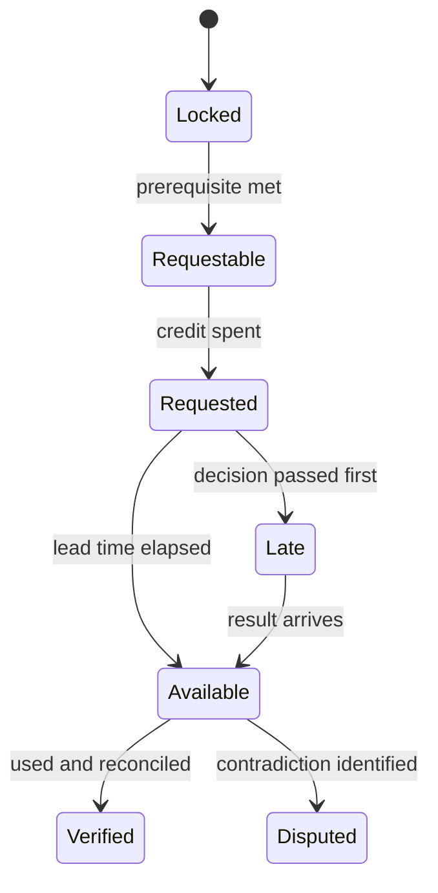

# Procurement Under Pressure: State Transitions

**Scenario ID:** `procurement-under-pressure@0.1.0`  
**Artifact:** Deterministic state, evidence, crisis, and gate contract  
**Status:** Paper design. Not calibrated. Not an implementation specification until playtested.  
**Depends on:** `FOUNDATION.md`, `DECISIONS.md`, `SCORING.md`, `REFERENCE_RUNS.md`

## 1. Purpose

This document defines how a run evolves without allowing an LLM to improvise scenario facts or decide whether a participant chose the hidden “correct” option.

It converts participant responses into auditable facts, applies deterministic transitions, releases evidence, schedules consequences, and supplies gate facts for later adjudication. It does **not** calculate participant competency. Competency remains an evidence-based post-run assessment under `SCORING.md`.

The engine must preserve the three locked invariants:

1. The use case remains supplier quotation analysis and sourcing recommendations.
2. Program-health values remain hidden during a first attempt; only operational signals are exposed.
3. The final report leads with seven competency dimensions and gate status. The overall score is secondary.

## 2. Design rules

1. **Facts, not option points.** Option letters do not carry scores or fixed state deltas. A response creates facts only when its structured fields support them.
2. **Deterministic world.** Hidden truths, evidence payloads, lead times, and base crisis observations are versioned scenario content.
3. **Conditional consequence.** The same action can have different effects depending on evidence, ownership, controls, and prior commitments.
4. **No hidden-truth guessing.** A participant is not penalized for an undiscoverable fact. Avoidability is recorded separately.
5. **Recovery without erasure.** Later repair can improve the current program state; it cannot delete the original decision, contradiction, or exposure.
6. **Signals before scores.** First-attempt users see status, evidence, stakeholder response, and operating consequences, never numeric health or competence.
7. **Gates are separate.** State values cannot pass or fail a critical gate. The engine emits gate facts; the gate adjudicator applies the tests in `SCORING.md`.
8. **Pause is an action.** A controlled pause may improve governance while reducing near-term delivery confidence. It is not automatically strong or weak.

## 3. Canonical run state

```yaml
run:
  scenario_version: procurement-under-pressure@0.1.0
  mode: first_attempt | replay | calibration
  current_week: 0
  current_stage: frame
  current_decision: D01
  status: active | completed | invalidated
  investigation_credits_remaining: 10

program_health:                 # hidden during first attempt
  business_value: 45
  delivery_confidence: 40
  technical_integrity: 50
  data_readiness: 35
  trust_governance: 35
  financial_sustainability: 50
  user_adoption: 40

facts: {}                       # normalized, append-only fact history
evidence: {}                    # catalogue records and their availability
commitments: []                 # claims, scope, dates, thresholds, owners
open_risks: []
controls: []
signals: []                     # participant-visible operational messages
scheduled_events: []
gate_facts: []                  # facts for separate adjudication
decision_ledger: []             # raw response, extraction, effects, timestamp
audit_log: []
```

Health values are clamped to `0..100`. Each transition stores the before value, delta, after value, rule ID, and supporting fact IDs.

## 4. Fact contract

Every meaningful response is normalized into one or more facts:

```yaml
fact_id: F-D04-0001
key: scope.release_mode
value: controlled_pilot
source_decision: D04
source_fields: [action, rationale, acceptance_condition]
evidence_refs: [EV-WORKFLOW-01]
status: asserted | supported | contradicted | superseded
confidence: 0.0-1.0
effective_week: 2
supersedes: null
```

Deterministic validation may establish facts from bounded fields. An LLM may propose semantic facts from rationale, but uncertain or material facts require deterministic confirmation or review. The raw response is always retained.

### 4.1 Core fact namespaces

| Namespace | Examples |
|---|---|
| `mandate.*` | `release_defined`, `pilot_intent`, `decision_date_defined` |
| `value.*` | `baseline_owned`, `claim_eur8m_status`, `attribution_defined`, `stop_rule_defined` |
| `scope.*` | `release_mode`, `commodities`, `languages`, `capabilities`, `exclusions` |
| `authority.*` | `human_recommendation_retained`, `award_action_enabled`, `authorized_acceptor_named` |
| `architecture.*` | `pattern`, `task_boundaries_defined`, `fallback_defined`, `prohibited_actions_defined` |
| `data.*` | `minimum_sources_selected`, `supplier_coverage_profiled`, `label_validity_reviewed`, `lineage_defined` |
| `model.*` | `production_route`, `approved`, `sanitized_test_only`, `switch_condition_defined` |
| `evaluation.*` | `segmented_thresholds_defined`, `gold_owner_named`, `severity_defined`, `abstention_defined` |
| `delivery.*` | `thin_slice_frontloaded`, `api_review_started`, `replan_trigger_defined`, `temporary_path_controlled` |
| `resourcing.*` | `evaluation_capacity`, `security_capacity`, `change_capacity`, `operations_capacity`, `contingency_pct` |
| `workflow.*` | `embedded`, `duplicate_entry`, `field_evidence_visible`, `override_recorded`, `adoption_threshold_defined` |
| `economics.*` | `unit_cost_model`, `loop_sensitivity`, `cache_enabled`, `loop_limit`, `quality_aware_fallback` |
| `operations.*` | `monitoring_usable`, `incident_owner`, `containment_usable`, `rollback_usable` |
| `claim.*` | `text`, `subject`, `status`, `material`, `communicated_to` |

### 4.2 Support rule

A fact is `supported` only when the response contains the fields required by the decision contract and cites available evidence where evidence is reasonably required. Mentioning a control without an owner or usable condition normally remains `asserted`.

## 5. Evidence state machine

Evidence moves through explicit states:



`Available` means the payload can be viewed. `Verified` means the participant used it coherently or reconciled it with another source. The engine must never promote evidence to `Verified` merely because it was opened.

### 5.1 Investigation rules

- Policy/delegation/model-data rules and the source inventory/ownership map are free.
- All other normal requests cost one credit.
- An urgent request after its linked crisis begins costs two credits unless an earlier monitoring or evidence stream covers it.
- A request records request week, lead time, owner, linked decision, and latest useful week.
- Insufficient remaining credits blocks the request. It does not produce a negative score by itself.
- Unused credits have no terminal value.

### 5.2 Evidence catalogue

| Evidence ID | Cost | Lead time | Reveals | Primary hidden truths | Latest useful point |
|---|---:|---:|---|---|---|
| EV-POLICY-01 | 0 | immediate | delegation, segregation of duties, approved model/data rules | HT-10 | D07/D13 |
| EV-SOURCE-01 | 0 | immediate | 12-source inventory, owners, preliminary access routes | HT-02, HT-09 | D06 |
| EV-WORKFLOW-01 | 1 | 1 week | activity-level time study; 70% normalization/exception effort | HT-05 | D04 |
| EV-FINANCE-01 | 1 | 2 weeks | baseline and savings attribution defects | HT-01 | D15 |
| EV-FIELD-01 | 1 | 2 weeks | field completeness and reconciliation | HT-03 | D08 |
| EV-SEGMENT-01 | 1 | 2 weeks | 35% supplier-history gap and strategic-supplier bias | HT-03 | D08 |
| EV-LABEL-01 | 1 | 2 weeks | historical award target is not objective best-supplier truth | HT-04 | D08 |
| EV-FORMAT-01 | 1 | 2 weeks | language/format distribution and difficult cohorts | HT-07 | D08 |
| EV-USER-01 | 1 | 1 week | duplicate review/re-entry and portal rejection risk | HT-08 | D11 |
| EV-API-01 | 1 | 1 week | six-week median security-review lead time | HT-09 | D09 |
| EV-MODEL-01 | 1 | 2 weeks | external advantage and private-route adequacy with controls | HT-06 | D07/D14 |
| EV-THREAT-01 | 1 | 2 weeks | task-level data flow, threats, processing and control gaps | HT-06, HT-10 | D14 |
| EV-VOLUME-01 | 1 | 1 week | reprocessing and review-loop sensitivity | HT-11 | D12 |
| EV-EVALDESIGN-01 | 1 | 2 weeks | viable segmented gold-set and acceptance design | HT-03, HT-07 | D08 |
| EV-COHORT-01 | 1 | 1 week | two-commodity pilot viability within 16 weeks | HT-02, HT-12 | D04/D09 |

Evidence content is immutable for the scenario version. Presentation order may vary only when the scenario version explicitly defines equivalent variants.

## 6. Time and stage progression

| Stage | Decisions | Nominal weeks | Exit requirement |
|---|---|---:|---|
| Frame | D01-D04 | 0-2 | mandate, value hypothesis, investigation allocation, initial scope |
| Design | D05-D08 | 3-5 | component, data, model, and evaluation contracts |
| Plan | D09-D12 | 5-7 | critical path, resourcing, workflow, and economics plan |
| Defend | D13-D16 | 8-10 | sponsor/CISO/Finance challenges and dependency replan |
| Operate | D17-D20 | 13-16 | evaluation, adoption, cost responses, final recommendation |

Submitting a decision advances to its defined week, resolves due evidence and events, applies transitions, and emits signals. A participant cannot edit a submitted decision. A later decision can explicitly supersede a fact while preserving history.

## 7. Health-effect grammar

Use named effect sizes so tuning remains visible:

```yaml
effect_sizes:
  small: 5
  material: 10
  severe: 15
```

Calibration may tune a rule within the ranges in `FOUNDATION.md`, but may not change its direction without a scenario-version change.

A single response normally produces no more than two positive and two negative health effects. This prevents verbose answers from accumulating artificial advantage. Duplicate facts do not stack. Crisis effects can exceed this limit because they represent operating consequences.

## 8. Decision transition table

The table defines the principal deterministic transitions. Qualitative assessment remains outside this engine.

| Decision | Supported facts or condition | Hidden state effect | Participant-visible signal | Gate fact |
|---|---|---|---|---|
| D01 | bounded pilot plus owner and revision condition | `delivery +10`, `trust +5` | “Week 16 is recorded as an evidence decision for a bounded cohort.” | none |
| D01 | enterprise promise without bounded authority/gates | `delivery -10`, `trust -10`, `business +5` | “Sponsor confirms the public launch expectation; scope and acceptance remain unresolved.” | `G1 exposure` if award action included |
| D01 | open discovery without time-box/decision date | `delivery -10`, `business -5` | “Steering group asks when discovery will produce a decision.” | none |
| D02 | Finance-owned hypothesis, attribution and pivot condition | `business +10`, `financial +5` | “Benefit claim is marked provisional pending baseline.” | none |
| D02 | EUR 8m/30% recorded as verified commitment without baseline | `business -5`, `trust -5` | “The headline target enters the steering baseline without an attribution method.” | `G6 exposure`, not failure yet |
| D03 | request tied to uncertainty, decision, owner and useful date | relevant dimension `+5` when evidence arrives and is used | “Evidence request accepted; result due in week N.” | affects `reasonably_obtainable` |
| D03 | duplicate or untargeted request | no positive effect; credit consumed | “Request accepted, but no decision dependency is recorded.” | none |
| D04 | bounded cohort/capability/authority/exclusions and exit criteria | `business +10`, `delivery +10`, `trust +5` | “Pilot boundary accepted for planning.” | clears pending G1 exposure if commitments excluded |
| D04 | broad European scope without dependency/evidence boundary | `delivery -15`, `user -5`, `trust -5` | “The proposed release depends on unresolved sources, cohorts, and controls.” | pending G1 if material action enabled |
| D04 | reduced scope tied to measurable workflow value | `business +5`, `delivery +10` | “Document and rules value will be tested independently of recommendation.” | none |
| D05 | decomposed hybrid/component architecture with fallback | `technical +10`, `trust +5`, `financial +5` | “Tasks now have separate technologies, failure boundaries, and fallbacks.” | none |
| D05 | autonomous end-to-end agent with broad tools | `technical -10`, `trust -15`, `financial -5` | “The design couples extraction, judgment, and action under one failure boundary.” | G1/G7 exposure |
| D05 | historical awards used as target after EV-LABEL-01 is available | `technical -10`, `data -15`, `trust -5` | “Known target ambiguity remains in the recommendation design.” | G6 exposure; G4 later if released |
| D06 | minimum authoritative sources, lineage, quality and fallback | `data +15`, `delivery +10` | “Five purpose-critical sources form the first-release data contract.” | none |
| D06 | all 12 required before first value | `delivery -15`, `financial -5` | “Integration breadth is now on the critical path.” | none |
| D06 | upload route explicitly temporary and controlled | `delivery +5`, `data -5`, `user -5` | “Temporary ingestion is viable but creates reconciliation and transition work.” | none |
| D06 | representativeness/label claim contradicted by available evidence | `data -15`, `trust -10` | “Data fitness claim conflicts with profiling or label evidence.” | G6 exposure |
| D07 | approved route with task evidence, controls and fallback | `technical +10`, `trust +10` | “Approved model route is accepted for bounded tasks.” | G2 pass evidence |
| D07 | sanitized external comparison plus approved fallback | `technical +5`, `delivery +5` | “Model optionality is preserved without production-data exposure.” | G2 pass evidence |
| D07 | production supplier data sent to unapproved endpoint | `trust -25`, `technical -10` | “Unapproved production-data processing is recorded as a control breach.” | G2 fail fact |
| D08 | segmented metrics, severity, threshold, abstention and owner | `technical +15`, `data +10`, `trust +10` | “Release acceptance is defined by task and material cohort.” | G3 pass evidence |
| D08 | aggregate accuracy alone | `technical -10`, `data -10` | “Critical cohorts and error severity remain invisible to the release gate.” | G3 exposure |
| D09 | dependency validation, thin slice and harness front-loaded | `delivery +15`, `technical +5` | “Critical-path evidence precedes UI completeness.” | none |
| D09 | UI/agent flow first, integration later | `delivery -10`, `technical -5` | “Visible progress increases while the access dependency remains unresolved.” | G6 exposure if called ready |
| D09 | permanent manual upload as target state | `delivery -5`, `user -10`, `data -5` | “Manual ingestion protects timing but weakens operating fit and lineage.” | none |
| D10 | balanced funded capacities plus contingency and year-one run cost | `delivery +10`, `financial +10`, `user +5` | “Evidence, controls, adoption, and operations have named capacity.” | G5 pass evidence |
| D10 | specialist controls deferred or assigned to unauthorized lead | `delivery -10`, `trust -10`, `user -5` | “Material responsibilities lack credible capacity or authority.” | G5 exposure |
| D11 | embedded evidence-led workflow with override and authority separation | `user +15`, `trust +10` | “Buyer review is embedded, traceable, and retains sourcing authority.” | G1 pass evidence |
| D11 | separate portal or email copy path | `user -10`, `technical -5` | “Duplicate review and re-entry remain in the operating design.” | none |
| D11 | material workflow action outside delegation | `trust -25` | “The workflow enables a supplier commitment outside approved delegation.” | G1 fail fact |
| D12 | unit economics, sensitivity, caching/limits and quality-aware fallback | `financial +15`, `technical +5` | “Cost is governed per accepted comparison, with task-level controls.” | none |
| D12 | one-call estimate retained after loop use is known | `financial -15`, `trust -5` | “The operating forecast excludes observed reprocessing and review loops.” | G6 exposure |
| D13 | human award authority plus reversible non-binding actions | `trust +15`, `business +5` | “Autonomy is bounded without removing workflow value.” | G1 pass evidence |
| D13 | autonomous award initiation accepted | `trust -30`, `business -10` | “Audit logging is present, but delegation policy is breached.” | G1 fail fact |
| D13 | material decision delegated to delivery team | `trust -15` | “No authorized owner accepts the commercial risk.” | G5 fail candidate |
| D14 | CISO concern accepted; approved task route re-evaluated/re-scoped | `trust +15`, `technical +10`, `delivery +5` | “The approved route and residual risk are reconciled with scope.” | G2/G5 pass evidence |
| D14 | CISO bypassed and prohibited processing continues | `trust -25`, `delivery -10` | “Sponsor escalation did not grant model/data permission.” | G2 fail fact |
| D15 | claim corrected, communicated and rebased | `trust +15`, `business +10`, `financial +10` | “The EUR 8m headline is withdrawn and replaced with attributable hypotheses.” | G6 recovery evidence |
| D15 | contradicted claim retained internally or externally as supported | `trust -25`, `business -15`, `financial -10` | “A material contradicted claim remains represented as verified.” | G6 fail fact |
| D16 | controlled temporary path, narrower cohort and transition owner | `delivery +10`, `trust +5`, `data -5` | “Week-16 learning is preserved through an approved temporary path.” | G2/G6 pass evidence if honestly labelled |
| D16 | scope/date kept by compressing evaluation/control work | `delivery -15`, `technical -10`, `trust -10` | “The original promise is retained by reducing readiness evidence.” | G3/G7 exposure |
| D17 | failed cohorts reliably contained with retest owner/threshold | `technical +10`, `trust +10`, `business -5` | “German and Czech complex formats are excluded and routed safely.” | G4 pass evidence |
| D17 | aggregate result used to release failed material cohorts | `technical -25`, `data -15`, `trust -20` | “Known commercial-field failures remain inside the release scope.” | G4 fail fact |
| D18 | embedded redesign plus assisted/shadow learning and recheck date | `user +15`, `delivery +5`, `business -5` | “Release mode changes while workflow fit is retested.” | G6 pass evidence if claim corrected |
| D18 | mandate/release despite verified workflow rejection | `user -25`, `business -15`, `trust -10` | “Technical acceptance proceeds despite contradictory usage evidence.” | G6 fail candidate if called business-ready |
| D19 | task tracing, caching, loop controls, quality preservation, reforecast | `financial +15`, `technical +5` | “Four-times cost is contained and unit economics will be revalidated.” | G3 pass evidence if quality preserved |
| D19 | continue without economic correction or apply silent universal cap | `financial -20`, `technical -10`, `trust -5` | “Cost or quality remains uncontrolled under live usage.” | G6/G3 exposure |
| D20 | recommendation reconciles evidence, scope, gates, acceptors and operations | effects follow selected outcome; no automatic bonus | “Final recommendation records included and excluded capabilities and conditions.” | resolves all pending gates |
| D20 | release contains applicable failed/unresolved material conditions | `trust -20`, relevant health `-15` | “Final release claim conflicts with one or more readiness conditions.” | applicable gate fail facts |

Short aliases in this table map to canonical variables: `business`, `delivery`, `technical`, `data`, `trust`, `financial`, and `user`.

## 9. Six crisis injections

D13 is a scheduled executive authority challenge, not a crisis injection. The six crises promised for v0.1 are C01-C06 below. Their base observations are fixed. Earlier choices change preparedness, available responses, urgency cost, and secondary consequences, but never suppress inconvenient evidence.

| Crisis | Trigger | Fixed observation | Preparedness modifiers | Decisions |
|---|---|---|---|---|
| C01 Model approval blocked | entering week 9 / after D13 | External model will not be approved before pilot; CISO asks why GenAI is necessary | EV-MODEL-01 and EV-THREAT-01 provide task evidence; approved fallback reduces delivery shock | D14 |
| C02 Benefit claim challenged | entering week 9 / after C01 | Finance proves EUR 8m includes planned negotiation and unverified avoidance | EV-FINANCE-01 and an earlier hypothesis make this validation/correction rather than surprise | D15 |
| C03 Source API delayed | entering week 10 / after C02 | Security review completes around week 15; meaningful integrated pilot evidence cannot finish by week 16 | early EV-API-01, thin slice, and temporary-path design improve recoverability | D16 |
| C04 Segmented quality failure | entering week 13 | aggregate field accuracy 93%; German/Czech complex 78% with material commercial errors; English simple 96% | segmented thresholds make failure detectable and containment pre-designed | D17 |
| C05 Workflow rejection | entering week 14 | duplicate review/re-entry; only 30% intent to use | EV-USER-01 and embedded design may reduce severity, but the fixture still requires a real workflow response | D18 |
| C06 Cost loop overrun | entering week 15 | shadow inference cost is 4× plan due to reprocessing and regeneration | EV-VOLUME-01, unit cost monitoring, caching and loop controls reduce containment time | D19 |

### 9.1 Crisis effect protocol

1. Emit the fixed observation.
2. Resolve preparedness facts as `prepared`, `partial`, or `unprepared`.
3. Apply the base shock and preparedness modifier.
4. Offer the linked decision response.
5. Apply the response transition.
6. Record whether the crisis evidence contradicts an active material claim.

| Crisis | Base shock before response | Prepared modifier | Unprepared modifier |
|---|---|---|---|
| C01 | `delivery -5`, `trust -5` | offset both shocks | additional `technical -5` |
| C02 | `business -10`, `financial -5` | `trust +5` for prior provisional claim | additional `trust -10` for prior verified claim |
| C03 | `delivery -15` | reduce shock to `-5` | additional `business -5` |
| C04 | `technical -15`, `data -10` | no additional shock; containment ready | additional `trust -5` |
| C05 | `user -15`, `business -5` | reduce user shock to `-5` if already embedded/tested | additional `delivery -5` |
| C06 | `financial -15` | reduce shock to `-5` if detected by monitoring before steering | additional `technical -5` |

Preparedness never eliminates the fact itself. For example, segmented evaluation does not make German and Czech performance pass; it makes the failure visible and containable.

## 10. Hidden-truth activation matrix

| Hidden truth | Earliest fair evidence | Consequence activation |
|---|---|---|
| HT-01 | EV-FINANCE-01 | C02 always reveals it; D15 tests correction |
| HT-02 | EV-SOURCE-01 plus source-to-outcome work | D06 all-source scope increases critical path |
| HT-03 | EV-FIELD-01 / EV-SEGMENT-01 | D06/D08 label and cohort claims; D20 recommendation scope |
| HT-04 | EV-LABEL-01 | D05/D06 supervised recommendation target |
| HT-05 | EV-WORKFLOW-01 | D04/D05 reduced-scope value route |
| HT-06 | EV-MODEL-01 | C01 and D14 approved-route viability |
| HT-07 | EV-FORMAT-01; C04 always reveals outcome | D08 detectability and D17 containment |
| HT-08 | EV-USER-01; C05 always reveals outcome | D11 workflow design and D18 recovery |
| HT-09 | EV-API-01; C03 always reveals actual delay | D09 sequencing and D16 replan |
| HT-10 | EV-POLICY-01 | D11/D13 action authority |
| HT-11 | EV-VOLUME-01; C06 always reveals outcome | D12 economics and D19 containment |
| HT-12 | EV-COHORT-01 | D01/D04/D09/D16 viable controlled-pilot route |

The “always reveals” entries guarantee fairness at the point of response. Earlier investigation earns preparedness and better options; it does not buy access to an answer key.

## 11. Gate-fact lifecycle

Gate status is not a mutable health field. The engine records factual candidates:

```yaml
gate_fact_id: GF-G4-0001
gate_id: G4
event: known_material_cohort_failure
source: C04
knowledge_week: 13
participant_action: released_without_containment
containment_present: false
evidence_refs: [EV-CRISIS-C04]
status: open_for_adjudication
```

### 11.1 Deterministic gate facts

| Gate | Engine can establish | Reviewer must decide |
|---|---|---|
| G1 | action enabled, materiality flag, delegation, use state | whether authorization/containment was effective |
| G2 | endpoint, data class, approval record, processing event | whether permission/sanitization existed before processing |
| G3 | production recommendation, threshold fields, cohorts, owner | whether coverage was materially sufficient |
| G4 | known failure, affected cohort, inclusion/exclusion, fallback | whether containment was operationally effective |
| G5 | accepted risk, named owner, authority map | whether owner actually held acceptance authority |
| G6 | claim, contradictory evidence time, audience, later correction | materiality and whether false status was knowingly preserved |
| G7 | action-capable release and presence of four required controls | whether each control was usable, not merely named |

An exposure is not a failure. A fail candidate is not a final failure. Calibration requires independent review of every fail and unresolved case.

## 12. Claims and contradictions

Every material readiness, value, cost, accuracy, approval, or compliance statement becomes a claim record:

```yaml
claim_id: CL-0001
subject: annual_savings
value: EUR_8m
status: hypothesis | estimated | verified | contradicted | withdrawn
material: true
created_week: 0
contradicted_week: 9
corrected_week: 9
audiences: [steering, external]
```

A contradiction creates G6 exposure only when all four tests in `SCORING.md` could be satisfied. Timely correction updates the active claim but retains the audit history. The engine must not infer dishonesty from a stale assumption that was openly corrected.

## 13. Observable-signal contract

First-attempt signals must be factual and non-coaching. They may state:

- an evidence result or its provenance;
- a dependency, variance, failure, or approval status;
- the consequence of the participant's recorded commitment;
- a stakeholder request or decision-right conflict;
- which previously defined condition has or has not been met.

They must not state:

- numeric health or competence scores;
- that an option was good, bad, optimal, or expected;
- an undiscovered hidden truth;
- a recommended next decision;
- rubric anchor language; or
- likely final gate adjudication.

Example:

> German and Czech complex quotations recorded 78% field accuracy, including errors in tooling amortization and logistics terms. Your release threshold for critical commercial fields is 97%. These cohorts remain in the currently recorded pilot scope.

This is permitted. “Contain these cohorts to protect G4” is coaching and is prohibited during a first attempt.

## 14. D20 terminal resolution

The final recommendation produces a release manifest:

```yaml
release_manifest:
  mode: release | conditional_release | reduced_scope | extend | pause
  cohorts_included: []
  capabilities_included: []
  actions_enabled: []
  exclusions: []
  evidence_refs: []
  unresolved_risks: []
  acceptors: []
  controls:
    monitoring: null
    incident_owner: null
    containment: null
    rollback: null
  benefit_measurement: null
  next_decision_date: null
  public_claim: null
```

The engine compares this manifest with all active facts and emits:

- included failed cohorts;
- unsupported capabilities;
- prohibited or unapproved actions;
- missing authorized acceptors;
- absent operational controls;
- unresolved material contradictions;
- excluded value routes;
- and the final program-health snapshot.

It does not label the participant competent or incompetent. The scoring and gate process consumes the ledger after the run closes.

## 15. Replay and benchmark integrity

- A first attempt receives a unique run ID and immutable scenario version.
- Evidence payloads and crisis observations are identical for all first attempts on v0.1.0.
- Randomness is prohibited in benchmark mode.
- Replays are marked `practice` and never overwrite the first-attempt record.
- A replay may reveal prior debrief information; its score must not be pooled with first attempts.
- Scenario authors and reference-run reviewers must be identifiable in calibration metadata.
- Any change to hidden truths, evidence content, crisis observations, gate conditions, or transition direction requires a scenario version increment.
- Numerical tuning alone requires a calibration revision and published change log.

## 16. Deterministic engine pseudocode

```text
submit(decision_id, response):
    assert decision_id == run.current_decision
    validate_required_fields(response)
    store_raw_response(response)

    facts = normalize(response)
    facts = deterministically_validate(facts, available_evidence, authority_map)
    append_fact_history(facts)

    resolve_due_evidence(run.current_week)
    apply_decision_rules(decision_id, facts)
    record_claims_and_contradictions(facts)
    emit_gate_facts(decision_id, facts)

    advance_clock()
    for event in due_events:
        emit_fixed_observation(event)
        apply_preparedness_effect(event)

    emit_non_coaching_signals()
    append_audit_record()

    if decision_id == D20:
        build_release_manifest()
        close_run()
```

The semantic normalizer must fail safely. If it cannot determine whether a material control exists, it records `unresolved` and requests reviewer adjudication; it must not award the fact based on fluent wording.

## 17. Consistency invariants

An implementation or paper simulation fails validation if any of these are violated:

1. A participant sees a numeric health score during a first attempt.
2. An option letter alone produces a positive competence result.
3. An LLM creates evidence, changes hidden truth, or decides a gate.
4. A late repair deletes the original commitment or contradiction.
5. A crisis observation changes because the participant chose a preferred option.
6. A failed cohort is treated as passing because the aggregate metric passes.
7. A named owner is treated as authorized without checking the authority map.
8. A pause automatically passes gates or receives a health bonus.
9. Credits are charged for the two free evidence categories.
10. A hidden truth affects avoidability before a fair discovery route existed.
11. State effects stack repeatedly for duplicated language.
12. Run B in `REFERENCE_RUNS.md` is structurally prevented from matching Run A's competence profile.

## 18. Paper-playtest trace

For each of the three authored runs, reviewers must produce a trace table:

| Step | Facts created/superseded | Evidence resolved | Health effects | Signal emitted | Gate facts |
|---|---|---|---|---|---|
| D01 | | | | | |
| ... | | | | | |
| D20 | | | | | |

Acceptance conditions:

1. All 60 decision records can be normalized without inventing missing facts.
2. All six crises fire at the defined point with the same base observations.
3. Run A ends as a controlled pilot with no expected failed gate.
4. Run B ends with a reduced-scope release and recommendation pause, with no automatic penalty for using less AI.
5. Run C creates the expected authority, permission, evaluation, containment, ownership, integrity, and operational-control fail candidates.
6. The unsafe route cannot mask gate facts through high business or delivery health.
7. At least one early weakness can be recovered, but its audit record remains.
8. Two independent reviewers agree on fact extraction for at least 90% of material facts before rubric scoring begins.

## 19. Open calibration issues

- The provisional health deltas need sensitivity testing; they are simulation mechanics, not empirical measurements.
- Crisis C05 currently becomes less severe when the workflow was embedded, while the reference fixtures still state 30% intent to use. Paper testing must confirm whether this should be a distinct observation variant or only a preparedness distinction.
- Evidence lead times may make four initial requests disproportionately valuable. Test whether stage-specific capacity is fairer than one pool of ten credits.
- The evidence catalogue contains 13 paid requests for ten credits. Validate whether meaningful trade-offs remain without creating an obvious canonical bundle.
- The two-effect stacking limit may underrepresent decisions such as D20; terminal reconciliation is intentionally exempt but needs review.
- Semantic fact extraction is the largest implementation risk. Before using an LLM normalizer, create hand-authored expected facts for all 60 reference decision records.
- Health signals may feel arbitrary if too many deltas occur without observable operational consequences. Remove any transition that cannot produce a comprehensible signal.

These are calibration questions. They must be resolved through traced paper runs and reviewer comparison, not by adding UI or model sophistication.
